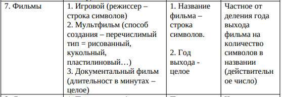
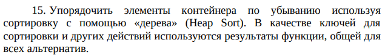

Пояснительная записка 
* Описание задания:  
Вариант 203  
  Начальное условие задачи:  
    
  Обработка данных в контейнере:  
       
    
* Tребуемые метрики, определяющие характеристики программы, для различных тестовых прогонов.   
Тесты с  вводом данных:

  Номер теста | Время
  ------------ | -------------
  01 | 1,03 ms
  02 | 1,10 ms
  03 | 1,63 ms
  04 | 1,80 ms
  05 | 2,12 ms

  
Тесты с рандомной генерацией: 

Номер теста | Время | N
------------ | ------------- | -------------
01 | 1,07 ms | 1
02 | 4,37 ms | 10
03 | 6,11 ms | 100
04 | 13,26 ms | 1000
05 | 108,16 ms | 10000
06 | 1140 ms | 100000
 

* Данные, демонстрирующие сравнение с характеристиками ранее разработанных программ:  
Это первая программа. 
 
* Основные характеристики программы:   
1) Число заголовочных файлов: 6
2) Число модулей реализации: 6 + main.c
3) Размер приложения(.exe): 83,3 КБ
4) Размер исходных кодов 29 КБ

  
  