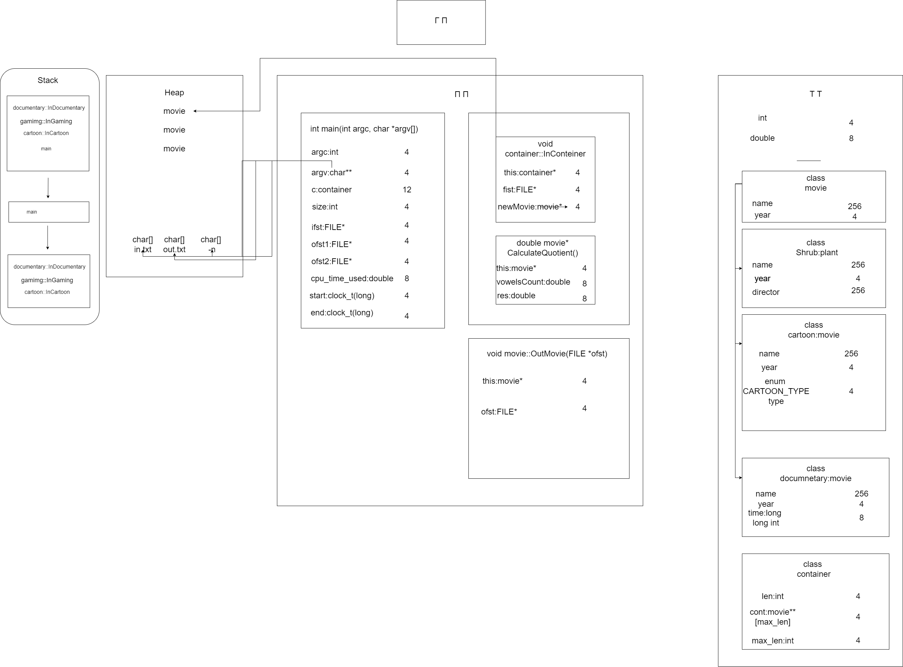

Пояснительная записка 
* Описание задания:  
  Вариант 203  
  Начальное условие задачи:  
    
  Обработка данных в контейнере:  
       

* структурная схема изучаемой архитектуры ВС с размещенной на ней разработанной программы;  
  

* Tребуемые метрики, определяющие характеристики программы, для различных тестовых прогонов.   
  Тесты с  вводом данных:

  Номер теста | Время
    ------------ | -------------
  01 | 0.0ms
  02 | 0.3ms
  03 | 0.4ms
  04 | 0.4ms
  05 | 0.5ms

  
Тесты с рандомной генерацией:

Номер теста | Время | N
------------ | ------------- | -------------
01 | 0.4ms | 10
02 | 15ms | 100
03 | 59ms | 1000
04 | 216ms | 10000
05 | 3786ms | 100000
 

* Данные, демонстрирующие сравнение с характеристиками ранее разработанных программ:  
  Исходный код программы стал занимать меньше места, но размер Unix Executable стал в два раза больше.
  Такая разница может быть обусловлена тем, что программа написана на с++.  
  Процедурная версия на языке С стала работать в 2 раза быстрее, чем в парадигме ООП на С++.
   
   
* Основные характеристики программы:   
1) Число заголовочных файлов: 6  
2) Число модулей реализации: 6 + main.cpp  
3) Размер Unix Executable: 181 КБ  
4) Размер исходных кодов 21 КБ  